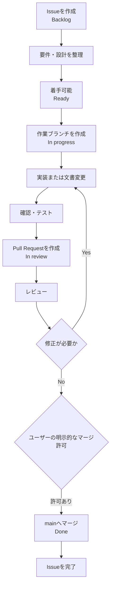
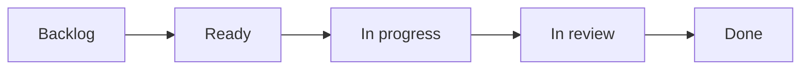
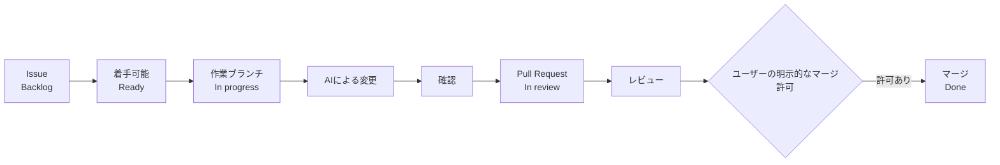

# 開発への参加と運用ルール

## 目的

この文書は，OPA の開発における Issue，ブランチ，コミット，Pull Request の運用ルールを定義します．

## 使用言語

コミットメッセージ，Issue，Pull Request，設計書，仕様書，README，コメントなどは，可能な限り日本語で記述します．

技術用語，ライブラリ名，クラス名，関数名，変数名，API 名などは，必要に応じて英語表記を使用します．

## 句読点と記号

日本語の文章では，原則として次の記号を使用します．

| 用途 | 使用する記号 |
| --- | --- |
| 句点 | `．` |
| 読点 | `，` |
| 引用符 | `‘ ’` |
| 二重引用符 | `“ ”` |

例えば，次のように記述します．

```text
この機能は，API のレスポンスを検証します．
設定値として ‘production’ を使用します．
表示名は “Public API” とします．
```

日本語文書では，原則として次の記号は使用しません．

- `。`
- `、`
- `「 」`
- `『 』`

ただし，技術的な記述ではこのルールを適用しません．

以下のような箇所では，その言語，形式，ツール，外部仕様で一般的または必要とされる記号をそのまま使用します．

- ソースコード
- shell command
- JSON
- YAML
- SQL
- Markdown 構文
- URL
- API の request / response
- 正規表現
- 外部仕様から引用する文字列
- ライブラリ名，識別子，設定値など変更すべきでない表記

例えば，以下はそのまま記述します．

```json
{
  "status": "ok",
  "message": "Hello, world."
}
```

```markdown
[README](README.md)
```

文章と技術的な記述が混在する場合は，日本語の説明文には本ルールを適用し，code block や inline code の内部には適用しません．

## 用語と表記の統一

同じ概念を指す用語，機能名，画面名，項目名，文書名などは，同じ表記に統一します．

表記揺れを避けるため，以下を基本とします．

- 同じ概念に対して，理由なく同義語，略称，別表記を混在させない
- Issue，Pull Request，設計書，仕様書，画面文言，テスト資料など，成果物をまたいでも同じ表記を使用する
- 新しい業務用語やプロジェクト共通用語を採用する場合は，[用語集](docs/glossary.md) に正式表記と意味を記録する
- 既存の正式表記を変更する場合は，影響範囲を確認し，可能な限り同じ Pull Request で関連箇所を横断的に更新する
- 一括更新が適切でない場合は，残る表記揺れを Issue または Pull Request に記録し，追跡できる状態にする
- ソースコード上の識別子，外部 API，ライブラリ固有名称など，外部仕様に従う必要がある表記は対象外とする

用語集へ登録する対象は，原則として以下のいずれかに該当するものとします．

- 業務用語で，意味や使い方を統一する必要があるもの
- 同じ意味で複数の表記，同義語，略称が使われやすいもの
- OPA 固有の意味を持つ用語
- Issue，設計書，API，テストなど複数の成果物で共通して使用するもの
- 表記揺れや意味の取り違えが仕様理解に影響するもの

一方，以下は原則として用語集へ登録しません．

- Markdown などのファイル名や文書タイトル
- 一般的なツール名やライブラリ名
- クラス名，関数名，変数名などの実装上の識別子
- 1か所でしか使用しない局所的な名称
- Status や Priority など，別の正式なルール文書ですでに定義されている値

文書タイトルやファイルへの導線は README.md などの文書一覧で管理し，用語集を文書一覧として使用しません．

プロジェクト共通の正式な用語と表記については，[用語集](docs/glossary.md) を正本とします．

## 基本開発フロー

すべての変更は Issue を起点として行います．

Issue は作成直後に必ず着手するものではなく，まず `Backlog` として管理します．

要件，対応内容，完了条件などが整理され，着手可能な状態になった Issue は `Ready` とします．

作業ブランチを作成して実際の作業を開始した時点で `In progress` とし，Pull Request を作成してレビュー段階へ移った時点で `In review` とします．

レビュー，必要な修正，確認が完了し，Pull Request が `main` へマージされた時点で `Done` とします．



## main ブランチ

`main` ブランチへの直接コミットは禁止します．

GitHub Rulesets により，原則として Pull Request を経由した変更のみを許可します．

`main` ブランチへの force push と，`main` ブランチ自体の削除も行いません．

## ブランチ名

ブランチ名には，変更種別，Issue 番号，内容を含めます．

例

- `docs/1-initial-documentation`
- `feature/12-public-api`
- `fix/24-response-handling`

Issue 番号を含め，どの Issue に対応するブランチか判断できる状態にします．

同一 Issue に対する作業ブランチは，明確な理由がない限り1本とします．

作業ブランチを作成する前に，同じ Issue に対応する既存ブランチがないか確認します．既存ブランチがある場合は，原則としてそのブランチを継続利用します．

ブランチ名を変更したいという理由だけで新しいブランチを追加作成しません．やむを得ず作業ブランチを作り直す場合は，変更の引き継ぎを確認したうえで不要になった旧ブランチを削除し，同じ Issue の不要な作業ブランチを残さないようにします．

例外的に同一 Issue で複数の作業ブランチを使用する場合は，Issue または Pull Request に理由と各ブランチの役割を記録します．

Pull Request 作成前と Issue 完了時には，同じ Issue に対応する不要な作業ブランチが残っていないか確認します．

## コミットメッセージ

コミットメッセージは，変更内容が分かる日本語を基本とします．

Issue に紐づく変更では，コミットメッセージ末尾に `(#Issue番号)` を付けます．

例

- `docs: 開発方針を追加 (#1)`
- `feat: API を追加 (#12)`
- `fix: レスポンス処理の不具合を修正 (#24)`
- `test: API のテストを追加 (#31)`
- `chore: 開発環境の設定を更新 (#42)`

## Issue

Issue には，可能な限り以下を記載します．

- 目的
- 対応内容
- 完了条件

Issue の分類や性質，対象領域，状態などはラベルを使用して表します．

必要なラベルのみを付与し，分類を細かくすること自体を目的として過剰に付与しません．

現在使用する主なラベルは以下のとおりです．

| Label | 用途 |
| --- | --- |
| `♻️ refactor` | 振る舞いを変えず，内部構造やコード品質を改善するもの． |
| `⚡ websocket` | WebSocket通信，リアルタイム更新，接続管理，再接続，イベント配信などに関するもの． |
| `⛔ blocked` | 外部要因や依存関係により，現在進行できないもの． |
| `✨ new feature` | 新しい機能や能力の追加に関するもの． |
| `🐛 bug` | 既存機能の不具合，想定外の動作，誤った処理などの修正に関するもの． |
| `💬 discussion` | 方針決定前の議論，意見募集，合意形成に関するもの． |
| `💾 database` | DBスキーマ，migration，query，index，データモデルに関するもの． |
| `📐 design` | UI / UX，API設計，データ設計，構造設計など設計全般に関するもの． |
| `📚 documentation` | README，仕様書，ガイド，コメントなどドキュメントに関するもの． |
| `🔌 api` | API仕様，エンドポイント，リクエスト / レスポンス，互換性に関するもの． |
| `🔐 security` | 認証，認可，脆弱性，秘密情報，セキュリティ要件に関するもの． |
| `🚀 enhancement` | 既存機能の改善，拡張，使い勝手向上に関するもの． |
| `🛠 maintenance` | 依存更新，設定変更，環境整備，定期保守などに関するもの． |
| `🧪 testing` | テスト追加，テスト改善，品質保証，自動テストに関するもの． |

複数の性質や対象領域に該当する場合は，必要に応じて複数のラベルを組み合わせます．

例えば，API の既存仕様を改善する Issue では，内容に応じて `🔌 api` と `🚀 enhancement` を併用できます．

`⛔ blocked` は恒久的な分類ではなく，外部要因や依存関係によって作業を進められない期間に使用します．ブロック要因が解消された場合は，必要に応じて解除します．

`💬 discussion` や `📐 design` は，方針や設計の整理が必要であることを示すために使用できます．議論や設計が完了した後も，その Issue の性質を表すうえで必要であれば残すことができます．

優先度は GitHub Projects の `Priority` フィールドで管理します．

Issue 内で議論した内容や決定事項は，可能な限り Issue コメントとして記録します．

### Sub-issue

大きな Issue を複数の独立した作業単位に分割した方が管理しやすい場合は，必要に応じて sub-issue を使用します．

sub-issue は，作業の見通し，依存関係，担当範囲，進捗などを明確にするための手段として使用し，単に Issue を細分化することを目的として乱用しません．

sub-issue の作成を検討する目安は，以下のとおりです．

- 親 Issue の完了までに，独立して進められる複数の作業が存在する
- 作業ごとに個別の完了条件を設定する必要がある
- 作業間の依存関係を明確にした方が進捗を把握しやすい
- 1つの Issue のままでは変更範囲やレビュー範囲が大きくなりすぎる
- 複数の Pull Request に分ける合理的な理由がある

一方，以下のような場合は原則として sub-issue を作成しません．

- 数個のチェック項目で十分に管理できる
- 1つの Pull Request で自然に完結する
- 作業内容が強く結合しており，分割するとかえって理解しにくくなる
- 管理上のメリットよりも Issue 数の増加による負担の方が大きい

sub-issue を利用する場合も，原則として各 sub-issue を通常の Issue と同様に扱います．

実際に独立した変更を行う sub-issue については，原則として `1 Issue = 1 Branch = 1 Pull Request` の単位で作業します．

親 Issue は全体の目的や成果を管理し，各 sub-issue は具体的な作業単位を管理します．

親 Issue の完了条件がすべての sub-issue の完了を前提とする場合は，必要な sub-issue がすべて完了していることを確認してから親 Issue を完了します．

Markdown ドキュメントから実在する Issue を参照する場合は，GitHub や Zensical 等の表示環境に依存せず遷移できるよう，Issue 番号を明示的な Markdown リンクにします．

例：

- `[Issue #10](https://github.com/<owner>/<repository>/issues/10)`
- `[Issue #10：認証・認可方式を設計する](https://github.com/<owner>/<repository>/issues/10)`

コミットメッセージ例など，実在 Issue への参照を意図しないサンプルの番号はリンク化の対象外とします．

## Pull Request

Pull Request には最低限，以下を記載します．

- 対応する Issue
- 変更内容
- 変更理由
- 確認方法
- テスト結果
- 影響範囲

原則として，1つの Pull Request には1つの主目的を設定し，主目的と直接関係しない変更を混在させません．

主目的を達成するために必要な付随変更や，同じ Issue 内で合意した関連判断は同じ Pull Request に含めることができます．
その場合は，Issue または Pull Request に含める理由と範囲を記録します．

独立して検討・実装できる技術選定や機能追加は，原則として別 Issue，別 Pull Request に分けます．

Pull Request を作成してレビュー可能な状態になった時点で，対応する Issue の Status を `In review` とします．

レビュー中に修正が必要となった場合も，Pull Request がレビュー工程にある間は原則として `In review` のまま管理します．

レビュー上の会話が発生した場合は，解決してからマージします．

AI は，レビューや必須 CI が完了してマージ可能な状態であっても，ユーザーから明示的なマージ許可がない限り Pull Request をマージしません．
AI はレビュー完了後にマージ可能であることを報告して停止し，ユーザーから明示的なマージ指示を受けた場合のみマージします．
会話の継続，レビュー実施の依頼，作業続行の指示等を，マージ許可として推測しません．

レビュー結果，追加の判断，修正理由などは，可能な限り Pull Request のコメントまたはレビューコメントとして記録します．

## レビュー方針

Pull Request のレビューは，過去の指摘事項や直前に修正した箇所だけを確認するのではなく，毎回，最新の変更全体を対象として総合的に行います．

初回レビュー，再レビュー，最終レビューのいずれでも，特定の観点だけに限定せず，変更内容に応じて少なくとも以下を確認します．

- 対応する Issue の目的，対応内容，完了条件との整合
- 変更差分の正しさ，抜け漏れ，不要な変更
- 既存仕様，設計，運用ルールとの整合
- 文書間，コード間，設定間の矛盾や重複
- 用語，命名，表記の一貫性
- 影響範囲と既存機能への回帰リスク
- エラー処理，境界条件，例外ケース
- セキュリティ，権限，秘密情報，個人情報などへの影響
- テスト内容，確認方法，CI / status check の状態
- ドキュメント，リンク，設定，マイグレーションなど関連資産の更新漏れ
- Pull Request 本文と実際の変更内容の一致
- マージ条件，未解決コメント，未完了事項の有無

上記は最低限の観点であり，変更内容に応じて必要な観点を追加します．

レビュー指摘への修正が行われた場合も，修正箇所だけを確認して完了とはしません．
修正後の最新状態を対象に，再度すべての観点から総合レビューを行い，新たな問題が生じていないことを確認します．

レビュー結果は，指摘の有無にかかわらず，必要に応じて Pull Request に記録します．

## GitHub Projects

進捗と優先度は GitHub Projects で管理します．

Status は以下を基本とします．



各 Status の意味は以下のとおりです．

| Status | 意味 |
| --- | --- |
| `Backlog` | Issue は作成されているが，まだ着手可能な状態として整理されていない |
| `Ready` | 要件，対応内容，完了条件などが整理され，着手可能な状態 |
| `In progress` | 作業ブランチを作成し，実装，文書変更，調査などの作業を進めている |
| `In review` | Pull Request が作成され，レビュー，修正，確認を進めている |
| `Done` | 必要なレビューと確認が完了し，変更が `main` にマージされている |

原則として Status は上記の順序で進めますが，状況に応じて前の Status へ戻すことがあります．

例えば，要件不足が判明した場合は `In progress` から `Ready` または `Backlog` へ戻すことができます．

Pull Request のレビュー中に修正が発生した場合は，通常のレビューサイクルの一部として扱い，原則として `In review` のままとします．

Priority は以下の4段階を使用します．

| Priority | 意味 | 基準 |
| --- | --- | --- |
| `Urgent` | 大至急 | 障害，業務停止，重大な不具合など，最優先で対応する必要がある |
| `High` | 至急 | 通常より早く対応する必要がある |
| `Medium` | 普通 | 通常の開発タスク．特別な理由がなければ原則これを使用する |
| `Low` | 後回しOK | 後回しでも影響が少ない改善や将来対応 |

新規 Issue の Priority は，明確な理由がない限り `Medium` を基本とします．

Project では，以下のビューを基本とします．

- `Board`：Status ごとの進捗確認
- `Backlog`：未着手または着手準備中の Issue を Priority 順に確認
- `All work`：Issue と Pull Request を含む全作業の確認

ChatGPT から GitHub Projects を操作できる場合は，開発イベントに合わせて Status を更新します．

- Issue 作成時：`Backlog`
- 要件，対応内容，完了条件が整理され，着手可能になった時：`Ready`
- 作業ブランチを作成して着手した時：`In progress`
- Pull Request を作成してレビュー段階へ移った時：`In review`
- Pull Request が `main` にマージされた時：`Done`

Priority についても，ユーザーと合意した値を ChatGPT から変更できる場合は反映します．

GitHub 接続で Projects 操作が利用できない場合は，手動更新が必要であることを明示します．

## AI を利用した変更

ChatGPT，Codex，Work などの AI ツールを使用する場合も，本運用ルールを適用します．

AI による変更も，原則として以下の流れを守ります．



AI から `main` ブランチへ直接コミットしません．
Pull Request のマージ許可に関する正式なルールは [Pull Request](#pull-request) に従います．
